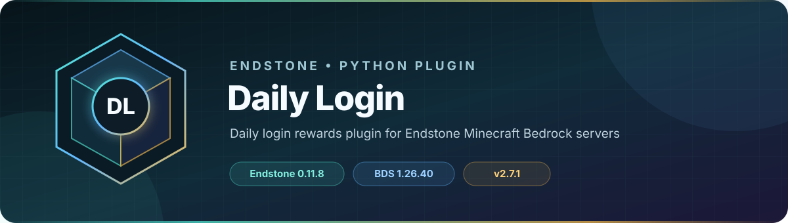

<!-- endstone-professional-header:start -->
<p align="center">
  
</p>

<p align="center">
  <a href="https://github.com/TheNINJALLO/endstone-daily-login/actions/workflows/wheel-release.yml"></a>
  <a href="https://github.com/TheNINJALLO/endstone-daily-login/releases/latest"></a>
</p>

<p align="center">
  
  
  
  =3.10" src="https://img.shields.io/badge/Python-%3E=3.10-3776AB?style=flat-square&amp;logo=python&amp;logoColor=white">
</p>

<p align="center">
  <strong>Daily login rewards plugin for Endstone Minecraft Bedrock servers.</strong>
</p>

<p align="center">
  <a href="#what-it-does">What it does</a> &bull;
  <a href="#how-to-use">How to use</a> &bull;
  <a href="#commands-and-permissions">Commands</a> &bull;
  <a href="#install">Install</a> &bull;
  <a href="https://github.com/TheNINJALLO/endstone-daily-login/releases">Releases</a>
</p>

## Overview

Daily login rewards plugin for Endstone Minecraft Bedrock servers. This release is aligned with Endstone 0.11.9 and Minecraft Bedrock Dedicated Server 1.26.44, and is distributed as a Python wheel for direct installation in an Endstone server.

## What it does

- Tracks consecutive logins and grants configurable daily rewards.
- Supports in-game administration, entity interaction, and an optional web dashboard.
- Stores reward and claim state persistently so players cannot claim the same day twice.

## How to use

1. Start once, then configure the reward calendar and optional interaction entity in the plugin data folder or admin form.
2. Set `ENDSTONE_DAILY_LOGIN_WEB_PASSWORD` before enabling the web dashboard; leave the dashboard disabled when it is not needed.
3. Operators open `/dailylogin` (aliases `/dl` and `/dailyreward`) to administer rewards; normal claims occur through the configured login/interaction flow.

## Commands and permissions

| Command / usage | What it does | Access |
|---|---|---|
| `/dailylogin`<br><sub>Aliases: `/dl`, `/dailyreward`</sub> | Open daily login admin panel | `dailylogin.admin` |

## Compatibility

| Component | Supported version |
|---|---|
| Endstone | `0.11.9` |
| Endstone API | `0.11` |
| Bedrock Dedicated Server | `1.26.44` |
| Python | `>=3.10` |
| Plugin release | `v2.7.2` |

## Install

Download the wheel from the matching GitHub release:

```bash
gh release download v2.7.2 --repo TheNINJALLO/endstone-daily-login --pattern "*.whl"
```

Copy the downloaded wheel into the server's `plugins/` directory, remove any older wheel for the same plugin, and restart Endstone.

> [!IMPORTANT]
> Use Endstone `0.11.9` with BDS `1.26.44`. Back up worlds and plugin data before upgrading a production server.

## Configuration and secrets

Runtime databases, logs, local `.env` files, server directories, and root `config.toml` files are excluded from source releases. When an example configuration is provided, copy it locally and keep live tokens, passwords, webhook URLs, and server identifiers out of Git.

## Release automation

Every `v*` tag runs [the wheel release workflow](.github/workflows/wheel-release.yml), builds the package in a clean GitHub runner, stores the wheel as a workflow artifact, and attaches it to the matching GitHub release.
<!-- endstone-professional-header:end -->

---

## Project guide

A daily login rewards plugin for Minecraft Bedrock Edition servers running Endstone.

Originally ported from the JavaScript Daily Login 2.7 by LEEFY.

## Features

- **Daily Login Rewards**: Players receive rewards for logging in daily
- **Streak Tracking**: Tracks consecutive login days with streak bonuses
- **Multiple Reward Types**:
  - Money (via scoreboard objectives)
  - Items (with enchantment support)
  - Structures (spawned at player location)
- **Entity Interaction**: Configure NPCs/entities with tags to open the claim menu
- **Web Dashboard**: Configure rewards and view player stats via web UI (port 25689)
- **Admin Panel**: In-game configuration via compass item

## Installation

1. Build the wheel:
   ```bash
   py -3.11 -m build
   ```
2. Copy the `.whl` file from `dist/` to your Endstone server's `plugins/` folder
3. Restart the server

## Configuration

### In-Game
- Hold a **compass** and right-click to open the admin panel (requires OP)
- Hold a **stick** and right-click to open the claim menu (configurable)

### Entity Interaction
To set up an NPC that opens the claim menu:
1. Spawn any entity (e.g., armor stand, villager)
2. Add the tag: `/tag @e[type=armor_stand,c=1] add daily_login`
3. Configure the interaction type in admin panel:
   - **Hit**: Open menu when player punches the entity
   - **Interact**: Open menu when player right-clicks the entity
   - **Both**: Either action works

### Web Dashboard
Set a unique dashboard password before starting Endstone, then access the web UI at `http://your-server-ip:25689`:

```bash
export ENDSTONE_DAILY_LOGIN_WEB_PASSWORD="replace-with-a-long-random-password"
```

The dashboard remains disabled when `ENDSTONE_DAILY_LOGIN_WEB_PASSWORD` is unset.

## Commands

| Command | Description | Permission |
|---------|-------------|------------|
| `/dailylogin` | Open admin panel | `dailylogin.admin` |
| `/dl` | Alias for dailylogin | `dailylogin.admin` |

## Requirements

- Endstone 0.11.9+
- Python 3.10+

## License

MIT
